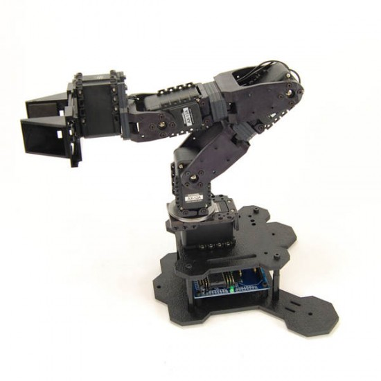
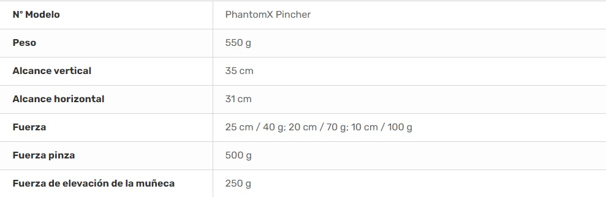
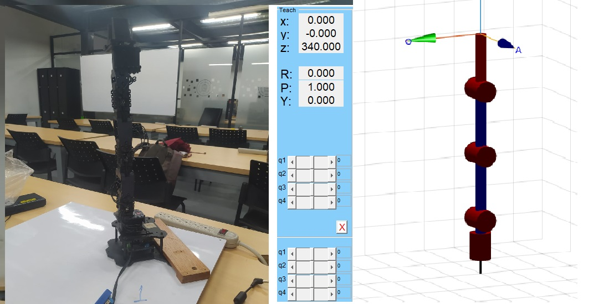
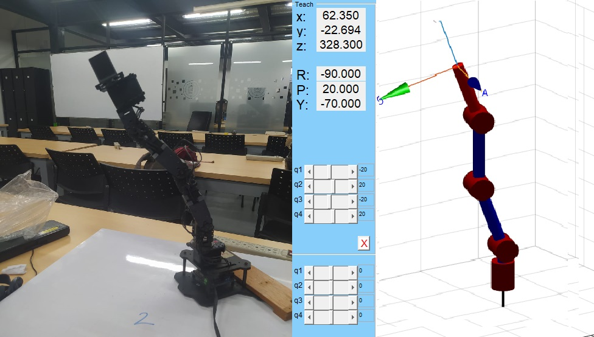
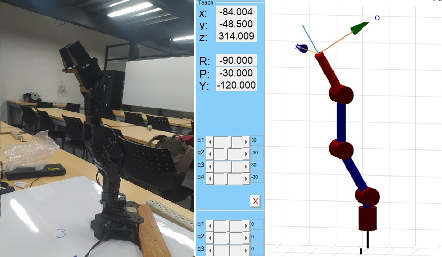
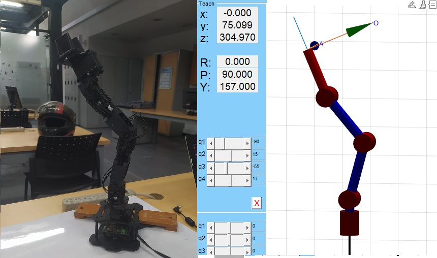
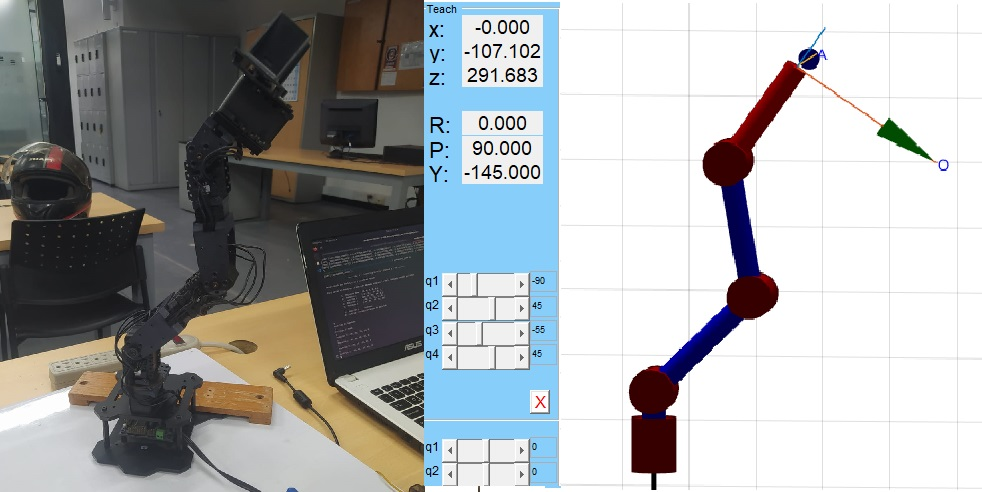
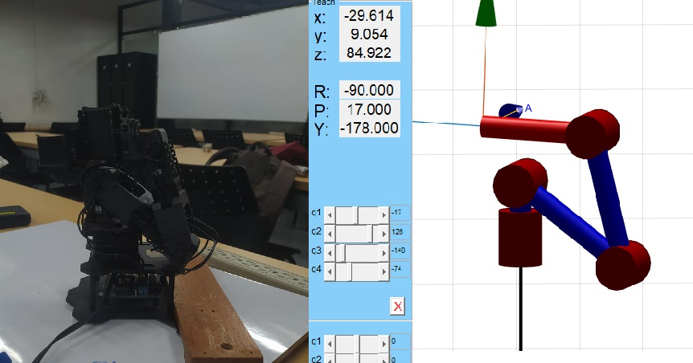

# Lab4_Cinematica_Directa-PhantomX
Lab. 4 - Cinematica Directa - Phantom X -Pincher- ROS  desarrollado por Daniel Cruz y Cristhian Pulido

https://user-images.githubusercontent.com/53317895/194696987-a6741fa5-e7da-409d-becc-c040b6b65f1b.mp4

## PhantomX Pincher 
Se trata de un brazo robotico con cinco actuadores que permiten el movimiento de cuatro articulaciones rotacionales y el accionamiento de una pinza dispuesta como herramienta 

### Especificaciones

### Diagrama (sistemas de referencia) 

### Parámetros Denavit-Hartenberg (DH) 

| $\mathbf{i}$ | $\mathbf{\theta_i}$ | $\mathbf{d_i}$ | $\mathbf{a_i}$ | $\mathbf{\alpha_i}$ |$\mathbf{offset_i}$ |
|:------------:|:-------------------:|:--------------:|:--------------:|:-------------------:|:-------------------:|
|      $1$     |         $q_1$       |      $L_1$     |       $0$      |   $-\frac{\pi}{2}$  |         $0$         |
|      $2$     |         $q_2$       |       $0$      |      $L_2$     |         $0$         |   $-\frac{\pi}{2}$  |
|      $3$     |         $q_3$       |       $0$      |      $L_3$     |         $0$         |         $0$         |
|      $4$     |         $q_4$       |       $0$      |      $L_4$     |         $0$         |         $0$         |

## Cambio de pose

Se realiza un cambio de pose a partir de la variación articular 

### Posición 1 (HOME)  [0, 0, 0, 0, 0]

### Posición 2  [-20, 20, -20, 20, 0]

### Posición 3  [ 30,-30, 30, -30, 0]

### Posición 4  [-90, 15, -55, 17, 0]

### Posición 5  [-90, 45, -55, 45, 10]

### Posición X  (Guardar) 

