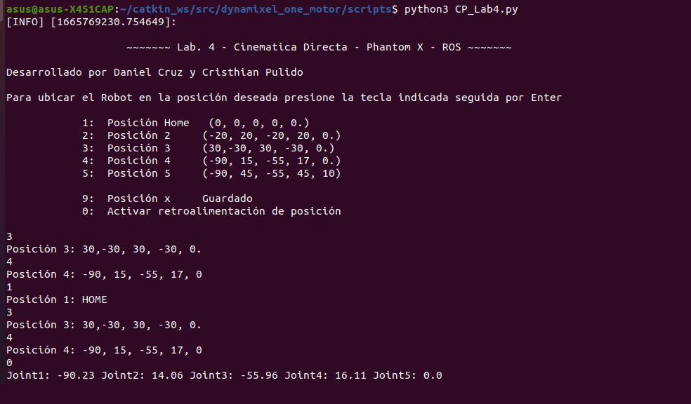

# Lab4_Cinematica_Directa-PhantomX
Lab. 4 - Cinematica Directa - Phantom X -Pincher- ROS  desarrollado por Daniel Cruz y Cristhian Pulido


https://user-images.githubusercontent.com/53317895/194696987-a6741fa5-e7da-409d-becc-c040b6b65f1b.mp4


## PhantomX Pincher 
Se trata de un brazo robotico con cinco actuadores que permiten el movimiento de cuatro articulaciones rotacionales y el accionamiento de una pinza dispuesta como herramienta 
<p align="center"></p>

### Especificaciones
<p align="center"></p>

### Diagrama (sistemas de referencia) 

<p align="center"></p>

### Parámetros Denavit-Hartenberg (DH) 
<div align="center">

| $\mathbf{i}$ | $\mathbf{\theta_i}$ | $\mathbf{d_i}$ | $\mathbf{a_i}$ | $\mathbf{\alpha_i}$ |$\mathbf{offset_i}$ |
|:------------:|:-------------------:|:--------------:|:--------------:|:-------------------:|:-------------------:|
|      $1$     |         $q_1$       |      $L_1$     |       $0$      |   $-\frac{\pi}{2}$  |         $0$         |
|      $2$     |         $q_2$       |       $0$      |      $L_2$     |         $0$         |   $-\frac{\pi}{2}$  |
|      $3$     |         $q_3$       |       $0$      |      $L_3$     |         $0$         |         $0$         |
|      $4$     |         $q_4$       |       $0$      |      $L_4$     |         $0$         |         $0$         |

</div>

* L_1 = 42 mm
* L_2 = 104 mm
* L_3 = 104 mm
* L_4 = 90 mm


## Cambio de pose

Se realiza un cambio de pose a partir de la variación articular 

### Posición 1 (HOME)  [0, 0, 0, 0, 0]
<p align="center"></p>

### Posición 2  [-20, 20, -20, 20, 0]
<p align="center"></p>

### Posición 3  [ 30,-30, 30, -30, 0]
<p align="center"></p>

### Posición 4  [-90, 15, -55, 17, 0]
<p align="center"></p>

### Posición 5  [-90, 45, -55, 45, 10]
<p align="center"></p>

### Posición X  (Guardar) 

<p align="center"></p>


## Matlab

El codigo desarrollado en Matlab permite crear un robot a partir de los parametros DH utilizando el toolbox de PeterCorke, para el caso del Phantom X se crean cuatro articulaciones rotaciones, por lo cual las variables articulares son asignadas a tetha. 
Una vez se crea el robot, se establece un offset en la segunda articualción para que las posiciones de HOME coincidan en la simulación y en el modelo real, finalmente se le asigna a cada articulación un valor de rotación acorde al ejercicio, esto se puede observar en la sección anterior de este repositorio.

```matlab
syms q1 q2 q3 q4 ; 
tetha= [q1, q2, q3, q4]; d=[42,0,0,0];
alpha= [-pi/2, 0 , 0, 0];  a= [0, 104, 104 , 90 ];

L(1) = Link('revolute','alpha',alpha(1),'a',a(1),'d',d(1));
L(2) = Link('revolute','alpha',alpha(2),'a',a(2),'d',d(2),'offset', -pi/2);
L(3) = Link('revolute','alpha',alpha(3),'a',a(3),'d',d(3));
L(4) = Link('revolute','alpha',alpha(4),'a',a(4),'d',d(4));

PhantomX = SerialLink(L,'name','PhantomX');
PhantomX.plot([deg2rad(0) deg2rad(0)  deg2rad(0) deg2rad(0)],'notiles','noname'); % Pose #1 (HOME)
xlim([-200 300]);ylim([-200 300]);zlim([-50 400]); view([130 30]);
```
## Python

<p align="center"></p>
  Para lograr manipular el Robot Phincher, se desarrolla un script en python basado en los scripts contenidos en el repositorio de Felipe Gonzalez [dynamixel_one_motor](https://github.com/fegonzalez7/dynamixel_one_motor.git). Este nuevo Script lleva como nombre [CP_Lab4.py](https://github.com/Danacruzrui/Lab4_Cinematica_Directa-PhantomX/blob/8ec12ad38b18fb7f0409b6129dc0f76efed332bb/dynamixel_one_motor-master/scripts/CP_Lab4.py) , en él se genera una comunicación activa desde la terminal hasta el robot, especificamente hasta cada articulación (motor) que lo componen, para el caso del pincher se trata de 4 articulaciones rotacionales y un motor que controla el movimiento de la herramienta.
  En terminos generales se puede identificar la siguiente estrucutura: 
  * Importar librerias y paquetes necesarios
  * Definición de funciones suscribirse a lo topicos del robot 
    *Accede a cada una de los valores articulares y se realiza la conversión rad-deg 
  * Definición de funciones publicar a lo topicos del robot 
    * Print del menu en consola 
    * Se asocian los valores del vector a los valores articulares 
    * Definición de valores articulares a publicar (según el numero seleccionado 1-5)
    * Publicar topicos 
    * Con el numero 0 se llaman a las funciones para suscribir e inicia la recepción de posición del robot 

  
  
```python

def callback(data):
    print (f"Joint1: {round(math.degrees(data.position[0]),2)} Joint2: {round(math.degrees(data.position[1]),2)} Joint3: {round(math.degrees(data.position[2]),2)} Joint4: {round(math.degrees(data.position[3]),2)} Joint5: {round(math.degrees(data.position[4]),2)}")
    rospy.sleep(3)

def listener():
    rospy.Subscriber("/dynamixel_workbench/joint_states", JointState, callback)
    #rospy.spin()

def joint_publisher():
    pub = rospy.Publisher('/joint_trajectory', JointTrajectory, queue_size=0)
    rospy.init_node('joint_publisher', anonymous=False)
    
    # Print de comandos
    welcome = """\n 
                   ~~~~~~~ Lab. 4 - Cinematica Directa - Phantom X - ROS ~~~~~~~


Para ubicar el Robot en la posición deseada presione la tecla indicada seguida por Enter

            1:  Posición Home   (0, 0, 0, 0, 0.)
            2:  Posición 2     (-20, 20, -20, 20, 0.)
            3:  Posición 3     (30,-30, 30, -30, 0.)
            4:  Posición 4     (-90, 15, -55, 17, 0.)
            5:  Posición 5     (-90, 45, -55, 45, 10)

            9:  Posición x     Guardado
            0:  Activar retroalimentación de posición
                  """
    rospy.loginfo(welcome)
    while not rospy.is_shutdown():
       
        
        key= input()
        i=0
        
        if key == '1':
            
            state = JointTrajectory()
            state.header.stamp = rospy.Time.now()
            state.joint_names = ["joint_1", "joint_2","joint_3", "joint_4", "tool"]
                
            point = JointTrajectoryPoint()

            ## 1. >>  0, 0, 0, 0, 0.
            point.positions = [math.radians(0), math.radians(0), math.radians(0), math.radians(0), math.radians(0)]  # 1
            
            point.time_from_start = rospy.Duration(0.5)
            state.points.append(point)
            pub.publish(state)            
            print('Posición 1: HOME')
            rospy.sleep(1)
            
               if key == '0':
           listener()

        if __name__ == '__main__':
            try:
                joint_publisher()
            except rospy.ROSInterruptException:
                pass
      ```
